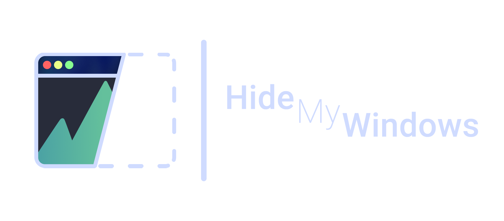
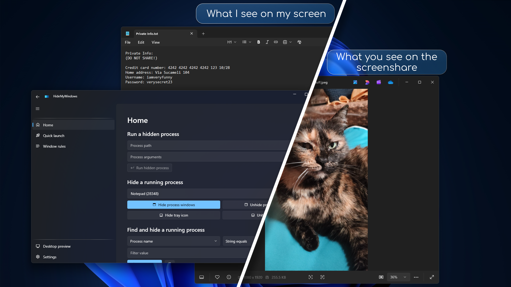

# 🪟 HideMyWindows

> 🌐 Disponible en: [English](README.md) | [Français](README.fr.md) | [Italiano](README.it.md) | [Română](README.ro.md) | [Polski](README.pl.md)



**HideMyWindows** est une application Windows qui permet de **cacher vos fenêtres du bureau contre les méthodes de capture d’écran** (captures, enregistrements vidéo, logiciels de streaming comme OBS).  
Elle est conçue pour les **utilisateurs soucieux de leur vie privée, les streamers et les étudiants** qui veulent mieux contrôler ce que les autres peuvent voir lorsqu’ils partagent leur écran.

---

## ✨ Fonctionnalités

- 🔒 **Masquer les fenêtres des captures et enregistrements**  
- 🎯 **Ciblage par fenêtre, processus ou nom** (supporte les expressions régulières aussi)  
- ⚡ **Règles automatiques** – masquez les programmes dès leur lancement  
- 🖥️ **Interface moderne et élégante** grâce à [lepoco/WPFUI](https://github.com/lepoco/wpfui)  
- 🔄 **Mode en arrière-plan** – fonctionne discrètement dans la barre d’état système
- 🚀 **Masquage rapide** pour une protection instantanée  
- ⚙️ Options configurables :  
  - Masquer **HideMyWindows** lui-même  
  - Affichage/masquage dans la barre des tâches  
  - Réduction en barre d’état système  
  - Méthodes de observation des processus et fenêtres  

---

## 📥 Installation

### Microsoft Store (bientôt disponible)
[](https://www.microsoft.com/store/apps)  

### Versions GitHub
- Téléchargez la dernière version depuis la [page Releases](../../releases).  
- Lancez l’installateur ou l’exécutable portable.

### Compiler depuis les sources
```bash
git clone https://github.com/zCri/HideMyWindows.git
cd HideMyWindows/HideMyWindows.App/
msbuild
# Ou ouvrez la solution dans Visual Studio et compilez
```

---

## 🚀 Utilisation

1. Lancez **HideMyWindows**.  
2. Utilisez l’outil **Trouver une fenêtre** ou entrez manuellement un PID / nom de processus.  
3. Trouvez votre processus et masquez-le!
4. Appliquez des **règles de fenêtres** pour masquer automatiquement des programmes.  
5. Réduisez dans la barre d’état système et laissez fonctionner en arrière-plan.  

📸 **Captures & Démo (bientôt disponible)**  


🎥 [Tutoriel YouTube – Bientôt](#)  

---

## ⚙️ Configuration

Aucun réglage externe requis. Les paramètres sont sauvegardés automatiquement.  

Options configurables :  
- Masquage automatique de HideMyWindows lui-même  
- Exécution en arrière-plan (mode barre système)  
- Affichage/masquage dans la barre des tâches  
- Méthode de observation des processus  
- Méthode de observation des fenêtres  

---

## 👥 Public cible

- 🔹 **Streamers** (Twitch, YouTube, OBS)  
- 🔹 **Utilisateurs soucieux de leur vie privée**  
- 🔹 **Étudiants** (éviter que les professeurs voient vos fenêtres)  
- 🔹 **Toute personne partageant son écran régulièrement**  

---

## 📜 Licence

Ce projet est sous licence **MIT avec clause Commons**.  
Vous êtes libre de l’utiliser, modifier et partager, mais **vous ne pouvez pas le vendre**.  

Voir [LICENSE.txt](LICENSE) pour plus de détails.

---

## 🙏 Crédits

- Développé par [@zCri](https://github.com/zCri)  
- Merci à [@ad2017gd](https://github.com/ad2017gd) pour son aide au développement  
- Interface basée sur [lepoco/WPFUI](https://github.com/lepoco/wpfui)  
- Et tous les développeurs des bibliothèques utilisées  

---

## 🌍 Localisation

- 🇬🇧 English
- 🇫🇷 Français
- 🇮🇹 Italiano
- 🇷🇴 Română
- 🇵🇱 Polski
- ... d’autres arrivent bientôt!

---

## ❤️ Soutien

Si vous appréciez ce projet et souhaitez soutenir le développement :  

- 💳 Faites un don via **PayPal** – [Faire un don](https://paypal.me/zCri)  
- 🛍️ Achetez l’application sur le **Microsoft Store** (bientôt)  

---
